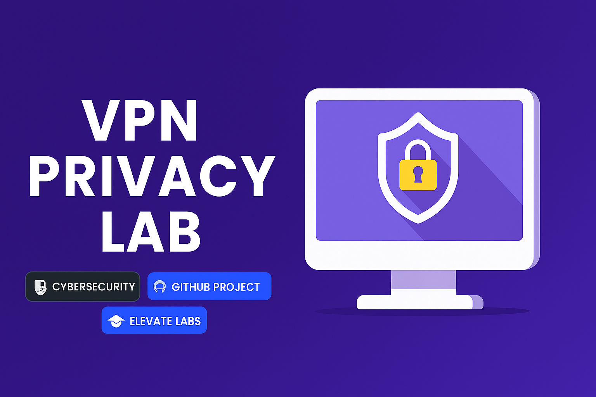
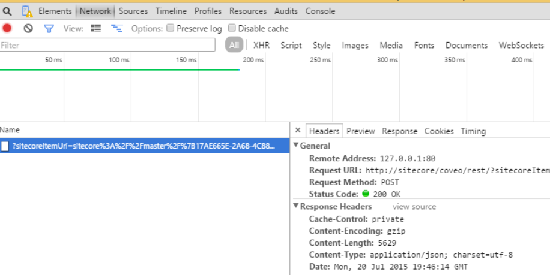

  

  
  
  
  
  
  
  

# 🔐 VPN Privacy Exploration — Cybersecurity Internship Task

This project documents my hands-on experience with VPN setup, tunneling protocols, and privacy analysis as part of Task 8 from Elevate Labs' Cybersecurity Internship.

---

## 🛠️ Tools Used
- **VPN Client:** ProtonVPN (Free tier)
- **IP Verification:** [whatismyipaddress.com](https://whatismyipaddress.com)
- **Traffic Inspection:** Browser Dev Tools (Network tab)

---

## 📸 Screenshots

| Screenshot | Caption |
|------------|---------|
|  | ProtonVPN connected to Netherlands server |
|  | IP changed from India to Netherlands — verified via whatismyipaddress.com |
|  | Encrypted traffic confirmed via browser network inspector |

---

## 📝 Summary

I installed ProtonVPN and connected to a nearby server. My IP address changed successfully, and encrypted traffic was confirmed using browser dev tools. I researched OpenVPN and WireGuard protocols, noting their trade-offs in speed and security. This task deepened my understanding of VPNs as privacy tools and their role in secure communication.

---

## 🔍 Key Concepts
- VPN tunneling & encryption
- IP masking
- Protocols: OpenVPN vs WireGuard
- VPN limitations: speed, trust, site blocks

---

## ⚠️ Disclaimer

This project is created for educational and internship purposes as part of Elevate Labs' Cybersecurity Internship. The VPN tools used (e.g., ProtonVPN) are third-party applications, and this repository does not endorse or distribute them. All screenshots and analysis are based on publicly available free-tier services.

Users are advised to follow local laws and organizational policies when using VPNs or privacy tools. This project does not promote bypassing restrictions or engaging in unauthorized activities.

---

## 🏁 Outcome

This task gave me practical experience with VPNs and a deeper understanding of privacy tools in cybersecurity. It also helped me prepare for interviews and build a stronger portfolio.
